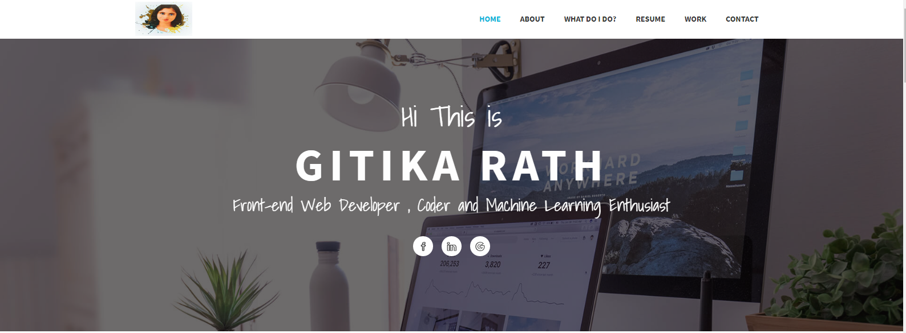

# My-Portfolio

A modern, responsive portfolio website showcasing my projects, experience, education, and research work. Built with HTML, CSS, and JavaScript, featuring a sleek 3D design with smooth animations and interactive elements.

## 🌐 Live Demo

**Portfolio Link:** [https://gitika123.github.io/My-Portfolio/](https://gitika123.github.io/My-Portfolio/)



## ✨ Features

- **Modern 3D Design**: Eye-catching 3D effects and animations throughout the site
- **Fully Responsive**: Optimized for all devices (desktop, tablet, mobile)
- **Interactive Navigation**: Smooth scrolling and animated navigation menu
- **Project Showcase**: Featured projects with images, descriptions, and GitHub links
- **Experience Timeline**: Professional experience displayed in an elegant timeline format
- **Research Publications**: Showcase of research work and publications
- **Recruiters Section**: Dedicated section for recruiters with contact information
- **Contact Form**: Easy-to-use contact form for inquiries
- **Dark Theme**: Modern dark theme with gradient accents

## 🛠️ Technologies Used

- **HTML5**: Semantic markup
- **CSS3**: Modern styling with animations, gradients, and 3D transforms
- **JavaScript**: Interactive functionality and smooth scrolling
- **Font Awesome**: Icons and social media icons
- **Google Fonts**: Poppins and Inter font families

## 📁 Project Structure

```
My-Portfolio/
├── index.html              # Main HTML file
├── assets/
│   ├── css/
│   │   └── modern-portfolio.css  # Main stylesheet
│   ├── js/
│   │   └── modern-portfolio.js   # JavaScript functionality
│   └── img/
│       └── MyPic1.jpeg     # Profile image
├── dora.png                # Project image
├── driverdrowsiness.png     # Project image
├── inboxangel.jpg          # Project image
├── monthlypricepredictio.jpg # Project image
├── palmprintrecognitionsystem.png # Project image
├── paymentgatewayintegration.jpg # Project image
└── README.md               # This file
```

## 🚀 Getting Started

### Prerequisites

No prerequisites needed! This is a static website that can be opened directly in a browser.

### Installation

1. Clone the repository:
```bash
git clone https://github.com/gitika123/My-Portfolio.git
```

2. Navigate to the project directory:
```bash
cd My-Portfolio
```

3. Open `index.html` in your web browser:
   - Simply double-click the file, or
   - Use a local server (recommended):
     ```bash
     # Using Python
     python -m http.server 8000
     
     # Using Node.js (http-server)
     npx http-server
     ```

4. Visit `http://localhost:8000` in your browser

## 📋 Sections

### 🏠 Home
- Hero section with animated typing effect
- Social media links
- Call-to-action buttons

### 👤 About
- Professional introduction
- Skills showcase (Languages, ML/AI, Frameworks, Tools & Cloud)
- Statistics and achievements

### 💼 Experience
- Timeline of professional experience
- Detailed role descriptions and achievements
- Education background

### 🎯 Projects
Featured projects include:
- **InboxAngel**: AI-powered email assistant (React, TypeScript, FastAPI, Groq)
- **Palmprint Recognition System**: Hybrid deep-learning biometric system (Python, CNN, Deep Learning)
- **Payment Gateway Integration**: E-commerce donation website (HTML, CSS, JavaScript)
- **Driver Drowsiness Detection**: Real-time safety monitoring system (Python, Transformers, Computer Vision)
- **ML Monthly Price Prediction**: Machine learning price prediction (Python, Scikit-learn, Node-RED)
- **DORA Flood Victim Emergency Chatbot**: AI chatbot for emergency assistance (IBM Watson, HTML, JavaScript, NLP)

### 📚 Research
- IEEE Conference Publication on Palmprint Recognition
- Research paper links and descriptions

### 👔 For Recruiters
- Open to opportunities section
- Contact information
- Interested domains (Full Stack, Software Engineering, AI/ML)

### 📧 Contact
- Contact form
- Email, phone, LinkedIn, and GitHub links

## 🎨 Design Features

- **3D Card Effects**: Hover animations on project cards
- **Gradient Overlays**: Beautiful gradient effects on images
- **Smooth Scrolling**: Seamless navigation between sections
- **Responsive Grid Layout**: Adaptive grid system for projects
- **Interactive Buttons**: 3D button effects with hover states
- **Animated Backgrounds**: Floating shapes and dynamic backgrounds

## 📱 Responsive Design

The portfolio is fully responsive and optimized for:
- 📱 Mobile devices (320px and up)
- 📱 Tablets (768px and up)
- 💻 Desktops (1024px and up)
- 🖥️ Large screens (1440px and up)

## 🔗 Links

- **Portfolio**: [https://gitika123.github.io/My-Portfolio/](https://gitika123.github.io/My-Portfolio/)
- **GitHub**: [https://github.com/gitika123](https://github.com/gitika123)
- **LinkedIn**: [https://www.linkedin.com/in/gitikarath](https://www.linkedin.com/in/gitikarath)
- **Repositories**: [https://github.com/gitika123?tab=repositories](https://github.com/gitika123?tab=repositories)

## 📧 Contact

- **Email**: gitikarath2001@gmail.com
- **Phone**: +1 (669) 245-8494
- **LinkedIn**: [linkedin.com/in/gitikarath](https://www.linkedin.com/in/gitikarath)
- **GitHub**: [github.com/gitika123](https://github.com/gitika123)

## 🎯 Open to Opportunities

I'm currently open to full-time roles in:
- Full Stack Development
- Software Engineering
- AI/ML Engineering
- Machine Learning
- Backend Development
- Frontend Development

Feel free to reach out via email or LinkedIn!

## 📄 License

This project is open source and available under the [MIT License](LICENSE).

## 🙏 Acknowledgments

- Font Awesome for icons
- Google Fonts for typography
- All the open-source libraries and tools used in this project

---

**Built with ❤️ by Gitika Rath**
